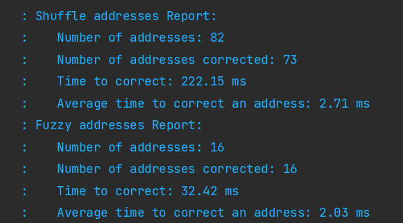

# Correct Address
Authors:\
Mihaela Chira \
Andrei Moldoveanu


- [Correct Address](#Correct-Address)
    * [About](#About)
    * [Run the application](#Run-the-application)
    * [Examples of address corrected](#Examples-of-address-corrected)
    * [Benchmark](#Benchmark)
    

## About
The purpose of this application is to correct an address. The application rest api resolves post methods by returning a corrected address.

*** 

## Run the application

### compile, test & package: 
    `mvn clean install`
### run: 
    `mvn exec:java -Dexec.mainClass=com.example.springproject.SpringProjectApplication`
### run for tests: 
    `mvn exec:java -Dexec.mainClass=com.example.springproject.SpringProjectApplication -Dexec.args="test"`
### run to serialize administrative units: 
    `mvn exec:java -Dexec.mainClass=com.example.springproject.SpringProjectApplication -Dexec.args="serialize"` 

**Default port used locally**: 8082

### Example of use:
POST Method: \
http://localhost:8082/correct-address \
body:
```json
{
"country": "England",
"state": "Essex",
"city": "Tendring District",
"postalCode": "",
"streetLine": ""
}
```

***
## Deploy
The application was deployed on heroku: https://dashboard.heroku.com/apps/proiect-pa-correct-address

### Example of use:
Post Method:\
https://proiect-pa-correct-address.herokuapp.com/correct-address \
body:
```json
{
"country": "England",
"state": "Essex",
"city": "Tendring District",
"postalCode": "",
"streetLine": ""
}
```


***
## Examples of address corrected
### Shuffle Addresses
Received Address:
```json
{
"country": "Pascani",
"state": "Romania",
"city": "Iassi",
"postalCode": "",
"streetLine": ""
}
```
Corrected Address:
```json
{
"country": "România",
"state": "Iaşi",
"city": "Municipiul Paşcani",
"postalCode": "",
"streetLine": ""
}
```
*** 
Received Address:
```json
{
"country": "Monkhopton",
"state": "England",
"city": "Shropshire",
"postalCode": "",
"streetLine": ""
}
```
Corrected Address:
```json
{
"country": "England",
"state": "Shropshire",
"city": "Monkhopton",
"postalCode": "",
"streetLine": ""
}
```


### Fuzzy Addresses


Received Address:
```json
{
"country": "",
"state": "Engalnd",
"city": "Englefeild",
"postalCode": "",
"streetLine": ""
}
```

Corrected Address:
```json
{
"country": "England",
"state": "West Berkshire",
"city": "Englefield",
"postalCode": "",
"streetLine": ""
}
```

***

Received Address:
```json
{
"country": "Engaln",
"state": "Cmbra",
"city": "",
"postalCode": "Barrw-n-Frness",
"streetLine": ""
}
```

Corrected Address:
```json
{
"country": "England",
"state": "Cumbria",
"city": "Barrow-in-Furness District",
"postalCode": "",
"streetLine": ""
}
```

## Benchmark
Average time to correct an address: ~2.5ms\
Test Results:\
